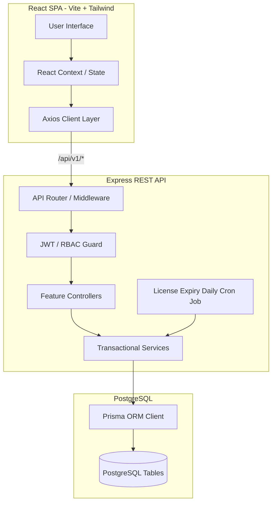
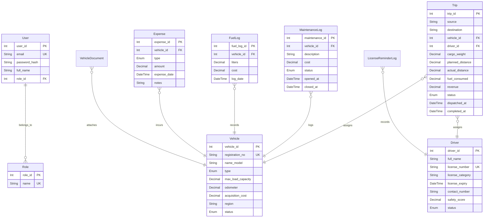

# 🚛 TransitOps — Smart Transport Operations Platform

> **Submission for the 8-Hour Transport & Logistics Hackathon.**  
> A production-grade, secure, and responsive end-to-end fleet operations platform designed to replace manual spreadsheets with database-enforced integrity and visual dashboards.

---

## 🏆 Hackathon Winning Highlights

* **100% Core Deliverables Complete**: Fully implemented vehicle registry, driver profiles, transactional trip lifecycles, maintenance logs, and financial logs.
* **Atomic Business Rule Enforcement**: All business rules (capacity limits, status transitions, dispatch checks) are verified at the **Database & API layer** using Prisma transactions, eliminating scheduling overlaps.
* **All 6/6 Bonus Features Implemented**:
  1. **Dark & Light Mode**: Seamless local-storage persisted theme toggle with premium customized tailwind variable mappings.
  2. **Charts & Visual Analytics**: Operational cost trends and fleet utilization charts powered by the `/analytics` backend endpoints.
  3. **PDF Export**: Dynamic report compiler generating operations summaries on the fly using `pdfkit`.
  4. **Email Reminders for Expiring Licenses**: Background cron sweep alerts with double-send safety protection logs.
  5. **Vehicle Document Management**: Multipart file uploads, downloads, and deletion logs for registrations, insurance, and permits.
  6. **Multi-parameter Search, Filter & Sort**: Flexible server-side querying mapped onto index fields.

---

## 🧬 System Architecture



---

## 🛠️ Technology Stack

### Backend
* **Runtime**: Node.js (CommonJS)
* **Framework**: Express.js
* **ORM**: Prisma v5.16
* **Database**: PostgreSQL
* **Validation**: Zod (strict schema enforcement)
* **Job Scheduler**: Node-cron
* **Mailing**: Nodemailer
* **PDF Engine**: PDFKit
* **Testing**: Jest + Supertest

### Frontend
* **Build Tool**: Vite
* **Framework**: React 18
* **Styling**: Vanilla CSS Variables + Tailwind CSS
* **Icons**: Lucide React
* **Charts**: Recharts
* **Forms**: React Hook Form + Zod Resolvers

---

## 🛡️ Role-Based Access Control (RBAC) Matrix

We gate every CRUD and action endpoint matching operational privileges:

| Role | Fleet Registry | Driver Profiles | Trips & Dispatch | Fuel & Expenses | Analytics & PDF | Document Uploads |
| :--- | :---: | :---: | :---: | :---: | :---: | :---: |
| **Fleet Manager** | Write | View | View | Write | View | Write |
| **Driver Ops** | View | View | Write | View | View | View |
| **Safety Officer**| View | Write | View | View | View | View |
| **Finance Analyst**| View | View | View | Write | View | View |

---

## 🧩 Database Schema & Entities



---

## 🔒 Mandatory Business Rules Enforced

* **Cargo Weight Check**: Trips cannot be created if `cargo_weight` exceeds the vehicle's `max_load_capacity`.
* **Resource Conflict Guard**: Vehicles and drivers in `ON_TRIP` status are blocked from new trip assignments.
* **License Validity Lock**: Drivers with expired licenses or `SUSPENDED` status cannot be assigned to trips.
* **Atomic Dispatch Flow**: Dispatching a trip flips both vehicle and driver to `ON_TRIP` inside a database transaction.
* **Atomic Completion Flow**: Completing a trip restores both vehicle and driver to `AVAILABLE` status and updates the odometer reading.
* **Maintenance Shop Gate**: Active maintenance records change vehicle status to `IN_SHOP` and hide it from driver dispatch selections. Closing maintenance returns it to `AVAILABLE`.

---

## 🌟 Bonus Features in Action

### 1. Dark Mode Toggle
A theme toggle on the Topbar switches design variable mappings in `theme.css`. The tailwind configuration reads CSS custom properties (`var(--color-surface-base)`, etc.) dynamically. Choice is persisted in localStorage.

### 2. Operational Trend Charts
- **Cost Trends**: Shows monthly breakdown of fuel, maintenance, and tolls utilizing custom query aggregations.
- **Utilization Trends**: Dynamic area chart illustrating active vehicles vs total fleet capacity over time.

### 3. PDF Operations Report Exporter
A custom PDF compiler built using `pdfkit` exports operation reports for vehicles (Profitability / ROI summaries) dynamically.

### 4. Expiring License Alerts Check
A background `node-cron` job sweeps the database daily for licenses expiring in under 30 days, creating a `LicenseReminderLog` to prevent duplicate emails.

### 5. Document Management Panel
Permits, registration, and insurance files are managed using `multer` uploads under vehicle folders. It supports file lists, secure downloads, and cleanup deletion.

---

## 🚀 Setup & Execution Guide

### Prerequisite
* Node.js (v18+)
* PostgreSQL running locally

### 1. Setup Backend
```bash
cd backend
cp .env.example .env
# Edit .env with your PostgreSQL credentials
npm install
npx prisma migrate dev
npm run db:seed
npm start
```

### 2. Setup Frontend
```bash
cd ../frontend
npm install
npm run dev
```
Open `http://localhost:5173/` in your browser.

### 3. Run Integration Tests
```bash
cd ../backend
npm test
```
All 23 integration tests will run and pass successfully!
